1. The method starts by initializing two pointers: `prev` (set to null) and `current` (set to the head of the list).

2. The while loop continues as long as `current` is not null, meaning we haven't reached the end of the list.

3. Inside the loop:
   a. We store the next node in `nextTemp` to avoid losing the rest of the list.
   b. We reverse the link by setting `current.next` to `prev`.
   c. We move `prev` to the current node.
   d. We move `current` to the next node (stored in `nextTemp`).

4. This process continues, effectively reversing the links one by one until we reach the end of the list.

5. Once `current` becomes null, we exit the loop.

6. Finally, we return `prev`, which is now the new head of the reversed list.

The key point of this iterative approach is that it reverses the linked list in-place, using only a constant amount of extra space (O(1) space complexity). It achieves this by manipulating the pointers directly, moving through the list once (O(n) time complexity, where n is the number of nodes).

```mermaid

graph TD
    subgraph reverseListIterative
    A[Start] --> B[Initialize: prev = null, current = head]
    B --> C{Is current != null?}
    C -->|Yes| D[Store nextTemp = current.next]
    D --> E[Reverse link: current.next = prev]
    E --> F[Move prev: prev = current]
    F --> G[Move current: current = nextTemp]
    G -->|Loop back| C
    C -->|No| H[Return prev]
    H --> I[End]

    %% Emphasizing the reverse linking process
    style E fill:#00000,stroke:#ff0000,stroke-width:4px
    E -->|Key Step| J["""
    Reverse the link:
    current node now
    points to previous node
    (was pointing to next node)
    """]
    style J fill:#000000,stroke:#000000,stroke-width:2px

    end

```

In this updated flowchart, I've made the following changes to emphasize the reverse linking process:

1. The node E, which represents the step "Reverse link: current.next = prev", is now highlighted with a red border and a light red fill color.

2. I've added an additional explanatory node (J) connected to this step, providing more detail about what's happening during this crucial part of the process.

3. The explanatory node is styled with a yellow background and border to make it stand out.

This emphasis highlights the core operation of the reversal process. Here's a brief explanation of why this step is so important:

1. Initially, each node in the linked list points to the next node (current.next points forward).

2. The reversal happens when we change this pointer to instead point to the previous node (current.next = prev).

3. This single line of code is what actually reverses the direction of the link.

4. By doing this for each node as we traverse the list, we end up reversing all the links, effectively reversing the entire list.

This emphasized step, combined with the movement of the pointers (prev and current) in the subsequent steps, is what allows the algorithm to reverse the linked list in-place, without needing any extra space proportional to the size of the list.